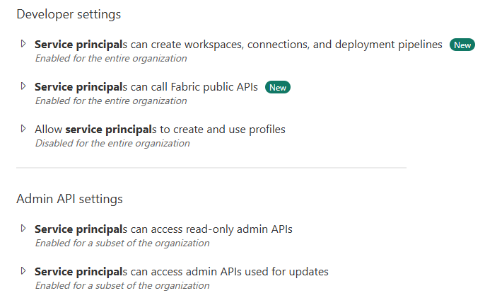

# Fab Shuffle

Region transfer tool for Fabric Workspaces

## Current State

This is a work in progress tool, features are getting built out as I go (and as APIs are available).

### Available Features
 - Full Data and Schema Transfer for: 
    - Lakehouses (including shortcuts and SQL Endpoint schema)
    - Warehouses
    - KQL Databases

## Usage

### Requirements
 - Docker
 - Service Principal Authentication

Fab Shuffle uses a Service Principal to automate data movement and to prevent several permission based headaches.

Steps to set up your Service Principal
1. [Create a Service Principal](https://learn.microsoft.com/en-us/entra/identity-platform/howto-create-service-principal-portal#register-an-application-with-microsoft-entra-id-and-create-a-service-principal) and [Client Secret](https://learn.microsoft.com/en-us/entra/identity-platform/howto-create-service-principal-portal#option-3-create-a-new-client-secret). **Important! Record your Tenant ID, Client ID, and Client Secret!**
2. Add your [Service Principal to an Entra ID Group](https://learn.microsoft.com/en-us/entra/fundamentals/quickstart-create-group-add-members)
3. Enable [Service Principal access to APIs](https://learn.microsoft.com/en-us/fabric/admin/enable-service-principal-admin-apis) via the Fabric Admin Portal 

    

4. Add your Service Principal to the Reader role for the Fabric capacity you want to transfer to in Azure
5. Add your Service Principal as Admin to the Fabric Workspace you would like to transfer
6. Add your Service Principal as Owner to connections used by your shortcuts

### To Run

`docker run -e SERVICE_PRINCIPAL_CLIENT_ID=00000000-1111-2222-3333-444444444444 -e SERVICE_PRINCIPAL_CLIENT_SECRET=RandomizedSecret -e SERVICE_PRINCIPAL_TENANT_ID=00000000-1111-2222-3333-444444444444 -e TARGET_CAPACITY_NAME=YourCapacityName -e SOURCE_WORKSPACE_NAME=CurrentWorkspaceName ghcr.io/cbattlegear/fab-shuffle:latest`

## Planned Features

- Full transfer of all API supported objects
- Better error handling and retry logic
- Configurable parallelism for data transfers
- Multiple Workspace support (with id mapping for transferred objects)