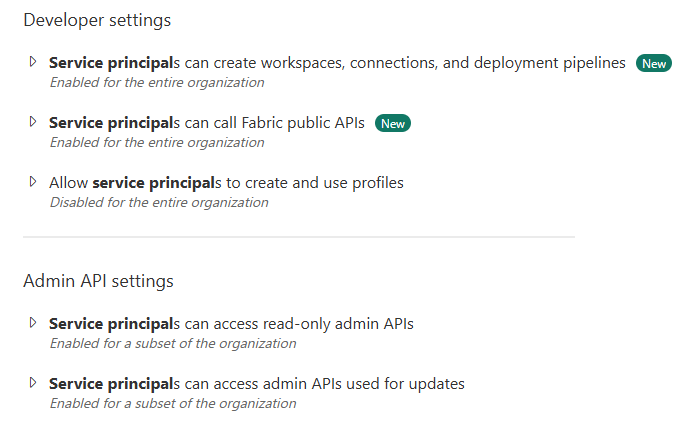

# Fab Shuffle

Region transfer tool for Microsoft Fabric workspaces.

[](https://portal.azure.com/#create/Microsoft.Template/uri/https%3A%2F%2Fraw.githubusercontent.com%2Fcbattlegear%2Ffab-shuffle%2Fmain%2Fdeploy%2Fazuredeploy.json)

```bash
docker run --rm -p 8080:8080 -v fab-shuffle-scratch:/app/local ghcr.io/cbattlegear/fab-shuffle:latest
```

Fab Shuffle recreates a Fabric workspace on a capacity in a different region and moves the
data across. Fabric blocks reassigning a workspace that contains Fabric items to a capacity
in another region, so the only way to "move" a workspace is to rebuild it — that is what
this tool automates.

See [Run it](#run-it) for what you need first: this needs a service principal with a handful
of Fabric settings turned on, and it will not get far without them.

## Current state

v2 is a Python application driven almost entirely by the
[Fabric REST API](https://learn.microsoft.com/en-us/rest/api/fabric/articles/), wrapped in a
small web UI that walks you through the move. (v1 was a PowerShell script around the `fab`
CLI; it still lives on the `main` branch's history.)

### Two ways to move a workspace

Fab Shuffle inspects the workspace and picks the cheaper of two strategies.

**Reassign** — if the workspace holds only Power BI content (reports, paginated reports,
semantic models, dashboards), there is nothing to rebuild. The cross-region restriction on
`assignToCapacity` only applies to Fabric items, so Fab Shuffle simply assigns the existing
workspace to a capacity in the target region. Nothing is copied and no new workspace appears.

Large semantic models are the wrinkle: they are backed by Azure Premium Files, which pins the
workspace to its region. Fab Shuffle converts each large model to the small storage format,
performs the reassignment, then switches them back. If a model can't be converted, or the
target region [doesn't support large models](https://learn.microsoft.com/en-us/power-bi/enterprise/service-premium-large-models#region-availability),
the move is refused up front — and if a conversion fails midway, the models already converted
are restored before anything else happens.

**Rebuild** — as soon as a single Fabric item is present, the workspace cannot be reassigned
across regions. Fab Shuffle creates a new workspace in the target region and recreates and
copies everything it supports.

### What gets migrated

| Item | Schema | Data | Notes |
| --- | --- | --- | --- |
| Lakehouse | ✅ | ✅ tables + files | Schema-enabled lakehouses supported |
| Lakehouse SQL analytics endpoint | ✅ | n/a | Views, procedures, and functions |
| Warehouse | ✅ | ✅ | Collation preserved |
| Eventhouse | ✅ | n/a | |
| KQL database (`ReadWrite`) | ✅ | ✅ | Table shortcuts recreated and excluded from the copy |
| Mirrored database | ✅ | n/a | Mirroring must be started by hand afterwards |
| Eventstream | ✅ | n/a | Sources, destinations, and operators rebound |
| KQL queryset | ✅ | n/a | Rebound to the migrated eventhouse |
| KQL dashboard | ✅ | n/a | Rebound to the migrated eventhouse |
| Semantic model | ✅ | n/a | Rebound to the migrated lakehouse or warehouse |
| Report | ✅ | n/a | Rebound to the migrated semantic model |
| Notebook | ✅ | n/a | Default lakehouse and environment attachment rebound |
| Environment | ✅ | n/a | Libraries and Spark settings; needs publishing afterwards |
| Dataflow Gen2 (CI/CD) | ✅ | n/a | Rebound to migrated items |
| Data pipeline | ✅ | n/a | Rebound to migrated items; connections reused and checked |
| Copy Job | ✅ | n/a | Rebound to migrated items; connections reused and checked |
| OneLake shortcuts | ✅ | n/a | Internal targets remapped to the new workspace |
| Workspace folders | ✅ | n/a | Hierarchy recreated, and items placed back into it |
| Custom Spark pools | ✅ | n/a | Recreated, and environments repointed at them |
| Workspace Spark settings | ✅ | n/a | Default pool, starter pool, and job settings |
| Spark job definition | ✅ | n/a | Exported as V2 so the code files come too |
| API for GraphQL | ✅ | n/a | In-Fabric data sources rebound; external ones left alone |
| Variable library | ✅ | n/a | Item references rebound |
| Mounted data factory | ✅ | n/a | Points at the same Azure Data Factory |
| Graph model / query set | ✅ | n/a | Mappings rebound; the index needs rebuilding |
| Map | ✅ | n/a | Lakehouse and KQL sources rebound |
| Activator (Reflex) | ✅ | n/a | Rules arrive switched off |
| Mirrored Azure Databricks catalog | ✅ | n/a | Arrives with automatic sync off |
| Snowflake database | ✅ | n/a | Points at the same Snowflake database |
| Workspace permissions | ✅ | n/a | Role assignments replayed |

On a rebuild, anything not in that table is reported by name and type — on the review screen
before you commit, and again as a warning on the run itself — so you know exactly what stays
behind in the source workspace.

KQL *shortcut* (follower) databases are recreated pointing at the same leader. The item's
properties do not name that leader, so it is read from the follower's own cluster with
`.show follower database`, whose `OriginalDatabaseName` is the leader's KQL Database item id
when the leader is another Fabric eventhouse. If the leader is in the workspace being
migrated the copy follows the copy, otherwise it keeps following the original. A follower of
an *Azure Data Explorer* database is reported instead, because the leader is identified by
name and its cluster URI is not exposed anywhere.

**Every semantic model migrates, including one named after a lakehouse or warehouse.** Those
used to be Fabric's default semantic models, provisioned alongside their parent, and were
skipped because the target workspace got its own. Fabric
[stopped creating them on 5 September 2025](https://learn.microsoft.com/fabric/data-warehouse/semantic-models)
and decoupled the existing ones into independent semantic models by 30 November 2025, so
there is no longer an auto-created copy to collide with — and skipping one now would quietly
lose a model somebody is using.

**Dataflows only migrate when they are Gen2 (CI/CD).** The item definition APIs do not
support Dataflow Gen1 or classic Gen2, so each dataflow is classified by probing its
definition — Fabric documents that filtering the item list by dataflow type does not return
reliable information. Anything that is not CI/CD-enabled is reported by name, telling you to
upgrade it with the upgrade wizard or Save As and migrate again.

**Some items arrive switched off.** Anything that acts on its own is created inactive, because
leaving it running would mean two copies acting on the same source at once. Mirrored databases
arrive with mirroring stopped, a mirrored Azure Databricks catalog with `autoSync` disabled,
and an Activator with every rule's `shouldRun` set to false — otherwise every alert fires
twice and every pipeline it triggers runs twice, once from each region. Each one reports what
its original setting was so you can restore it at cutover.

**A graph model's index is not copied.** The mappings and graph type come across, and the delta
tables they read migrate with their lakehouse, but the index itself is built from the data.
Refresh the model in the new workspace before running queries against it.

**A Spark job definition is exported as `SparkJobDefinitionV2`.** V1 and V2 share a payload
schema *and* a part filename, and only V2 carries the `Main/` and `Libs/` parts, so exporting
with the default would silently produce a job whose executable does not exist. Jars cannot be
carried inline at all, so a JVM job is reported instead.

**Environments arrive unpublished.** Publish them in the new workspace before running
anything that depends on them. Custom Spark pools are recreated with the workspace, so an
environment that pins one is repointed automatically; a *capacity* level pool belongs to the
capacity rather than the workspace and is reported instead.

**The target capacity should be the same size as the source's.** Capacity SKU caps Spark pool
and starter pool node counts, and the memory a semantic model may use, so moving to a smaller
capacity succeeds right up until something no longer fits. Fab Shuffle compares the two SKUs
while it builds the plan and warns on the review screen if they differ. Workspace Spark
settings are only patched where they actually differ from the new workspace's own defaults,
so a workspace that never customised them is left alone and never trips the capacity's node
count limits.

### Dependency order

Phase order is load bearing. Each phase records the source-to-target ids it created in an id
map, and later phases rewrite their exported definitions through it, so a phase can only
reference items created by an earlier one:

0. **Assessment and dependency check** — both run before anything is created, so a workspace
   that cannot migrate cleanly can be abandoned rather than left half built.
1. **Workspaces** — target and scratch workspaces, the folder tree, and the custom Spark
   pools plus workspace Spark settings. Pools come first because an environment pins one by
   id, so it has to exist before the engineering phase runs.
2. **Eventhouses** — before their KQL databases, which are created against
   `parentEventhouseItemId`.
3. **Lakehouses** — before warehouses, because warehouse views can reference lakehouse
   tables through the SQL analytics endpoint.
4. **Warehouses** — schema before data, so Copy Job activities have tables to land in.
5. **Mirrored databases** — data stores with their own SQL analytics endpoint, so they go
   with the others and before anything that reads them.
6. **Shortcuts** — after every data item exists, since a shortcut can point at any of them.
   This covers lakehouse shortcuts and KQL database table shortcuts. The SQL analytics
   endpoint is refreshed only now, so it sees both the copied tables and the new shortcuts,
   and only then is its schema copied.
7. **Connections** — recreate connections that point into the source workspace, aimed at the
   items just created, and put their new ids in the id map so everything after this binds to
   them.
8. **Eventstreams, KQL querysets, and KQL dashboards** — all three read the eventhouses and
   data stores above, and an eventstream sources from connections.
9. **Environments, notebooks, then dataflows, then the rest** — a notebook attaches to an
   environment and reads a lakehouse, and a semantic model can read a dataflow, so those come
   first. Spark job definitions, GraphQL APIs, graph models and query sets, maps, variable
   libraries and mounted data factories follow, since each reads something built earlier.
10. **Semantic models, then reports** — a Direct Lake or DirectQuery model embeds the SQL
    endpoint and GUID of the lakehouse or warehouse it reads, so it needs step 6 finished; a
    report embeds its model's GUID, so it runs after the models. Models are ordered among
    themselves using the relations graph, so a composite model follows what it reads.
11. **Data pipelines and Copy Jobs** — these orchestrate everything above, reading lakehouses,
    refreshing models, and invoking each other, so they are ordered among themselves by the
    relations graph.
12. **Activators** — last of the content phases. An Activator watches an eventstream or KQL
    database and acts by running pipelines and notebooks, so everything on both sides has to
    exist first.
13. **Permissions** — the source workspace's admins are granted as soon as the workspace is
    created, so a failed run never leaves a workspace nobody can open. The remaining roles
    are replayed here, last, so nothing is visible half built.
14. **Cleanup** — drop the scratch workspace and local staging.

### Connections

A connection's **target cannot be changed**: none of the six `Update Connection` request
variants accepts `connectionDetails`, so the path is fixed for the life of the connection.
Connections are also tenant scoped, so one that points at something *outside* the workspace
keeps working from the new region untouched.

That leaves connections pointing *into* the workspace being migrated. They are found before
anything is created, by scanning every connection path for the source workspace, its item
GUIDs, or their SQL and Kusto endpoints. Each hit also reports whether the service principal
holds **Owner** on it, which is the only one of the three connection roles (`User`,
`UserWithReshare`, `Owner`) that permits management.

Once the migrated items exist, Fab Shuffle recreates those connections against them and puts
the new connection id in the id map, so every item migrated afterwards binds to the
replacement. This is only automatic when the credential type needs no secret —
`WorkspaceIdentity` or `Anonymous` — because Fabric never returns an existing connection's
credentials. Anything else, including every gateway connection, is reported with the target
to build it against.

Connections that migrated items merely *use* are left alone and checked instead, reporting:

- connections the service principal **cannot see**, which will make the item fail to run;
- **personal cloud** connections, which cannot be shared;
- connections routed through a **gateway**. A virtual network gateway in particular stays in
  its original region, so it may no longer be the right path to the data.

### Dependency checking

Before creating anything, Fab Shuffle reads the [relations
APIs](https://learn.microsoft.com/en-us/rest/api/fabric/core/items/get-upstream-relations(beta))
for every item it plans to migrate and reports references that will not survive the move:

- a dependency in **another workspace**, which is not part of the migration, so the copy
  keeps reading from the original region;
- a dependency on an item **Fab Shuffle does not migrate**, which leaves the copy without
  its source.

Neither is visible by inspecting item definitions, and both otherwise fail silently. These
APIs are in beta and must be called with `?beta=true`; if they are unavailable to the service
principal, the step is skipped and the migration continues.

## Usage

### Requirements

- Docker
- A service principal

Fab Shuffle uses a service principal to automate data movement and to avoid a pile of
permission problems.

Steps to set up your service principal:

1. [Create a service principal](https://learn.microsoft.com/en-us/entra/identity-platform/howto-create-service-principal-portal#register-an-application-with-microsoft-entra-id-and-create-a-service-principal)
   and a [client secret](https://learn.microsoft.com/en-us/entra/identity-platform/howto-create-service-principal-portal#option-3-create-a-new-client-secret).
   **Record your tenant ID, client ID, and client secret.**
2. Add the service principal to an [Entra ID group](https://learn.microsoft.com/en-us/entra/fundamentals/quickstart-create-group-add-members).
3. Enable [service principal access to Fabric APIs](https://learn.microsoft.com/en-us/fabric/admin/enable-service-principal-admin-apis)
   in the Fabric admin portal, including "Service principals can create workspaces,
   connections, and deployment pipelines".

   

4. Give the service principal the Reader role on the target Fabric capacity in Azure.
5. Give the service principal Admin on the Fabric workspace you want to move.
6. Make the service principal Owner of any connections used by your shortcuts.

### Run it

Fab Shuffle is a container with a web wizard. Run it wherever you like — your own machine is
the simplest, and Azure Container Apps takes one click.

#### Locally

```bash
docker run --rm -p 8080:8080 -v fab-shuffle-scratch:/app/local \
  ghcr.io/cbattlegear/fab-shuffle:latest
```

Then open <http://localhost:8080>.

The volume is worth having. Lakehouse files and warehouse schema are staged on local disk on
the way past, and without it that goes into the container's writable layer and is thrown away
with the container.

#### In Azure

[](https://portal.azure.com/#create/Microsoft.Template/uri/https%3A%2F%2Fraw.githubusercontent.com%2Fcbattlegear%2Ffab-shuffle%2Fmain%2Fdeploy%2Fazuredeploy.json)

Deploys [`deploy/azuredeploy.json`](deploy/azuredeploy.json): a Container App running the
same public image, its environment, and a Log Analytics workspace for the container's logs.
The template's output `url` is the wizard.

Worth knowing before you use it:

- **Set `allowedClientIpAddress` to your own public IP.** Fab Shuffle has no sign-in of its
  own, so leaving it empty publishes the wizard to the internet. Nobody can do anything
  without supplying their own service principal, but an open migration console is not
  something to leave lying around.
- **It runs as exactly one replica, deliberately.** Sessions and run progress are held in the
  process, so a second replica would not know about your sign-in or your migration. Do not
  raise `maxReplicas`.
- **Delete it when you are done.** It bills while it runs, and it exists for one job.
- The region you deploy into has nothing to do with the region you are migrating *to*. That
  comes from the capacity you pick in the wizard.

Container Apps gives a few GiB of ephemeral disk, which is the ceiling on lakehouse file
transfer there. If you are moving more files than that, run it locally with a volume instead:
nothing else about the migration differs.

#### The wizard

1. **Sign in** with the service principal's tenant ID, client ID, and secret.
2. **Pick the target capacity** — its region is the destination region.
3. **Pick the source workspace.**
4. **Review** the plan. Fab Shuffle tells you whether the workspace can simply be reassigned
   or has to be rebuilt, lists anything it cannot move, and refuses to start if there is a
   blocker.
5. **Migrate**, watching each step report progress live, then delete the temporary artifacts.

Credentials are held in the container's memory for the life of the session and are never
written to disk.

The service principal also needs the **"Service principals can use Fabric APIs"** tenant
setting for Power BI, since the reassignment path calls the Power BI semantic model APIs and
must be able to update those models.

### Building the image yourself

```bash
docker build -t fab-shuffle .
docker run --rm -p 8080:8080 fab-shuffle
```

The image builds natively on `linux/amd64` and `linux/arm64`. Two build args exist for
networks that block the public package feeds:

| Build arg | Default | Purpose |
| --- | --- | --- |
| `NUGET_SOURCE` | `https://api.nuget.org/v3/index.json` | Feed for `sqlpackage` and `unpackdacpac` |
| `PIP_INDEX_URL` | `https://pypi.org/simple/` | Index for the Python dependencies |

```bash
docker build \
  --build-arg NUGET_SOURCE=https://your-proxy.example/nuget/v3/index.json \
  --build-arg PIP_INDEX_URL=https://your-proxy.example/pypi/simple/ \
  -t fab-shuffle .
```

If `sqlpackage`, `unpackdacpac`, or `azcopy` are missing at runtime, the affected item is
reported as a warning and the rest of the migration continues.

### Configuration

Every setting has a sensible default; override with environment variables when needed.

| Variable | Default | Purpose |
| --- | --- | --- |
| `FAB_SHUFFLE_PORT` | `8080` | Web UI port |
| `FAB_SHUFFLE_HOST` | `0.0.0.0` | Bind address |
| `FAB_SHUFFLE_SCRATCH` | `/app/local` | Local staging directory |
| `FAB_SHUFFLE_MAX_RETRIES` | `6` | Retries for throttled/transient Fabric calls |
| `FAB_SHUFFLE_COPY_JOB_TIMEOUT_SECONDS` | `43200` | Copy Job budget |
| `FAB_SHUFFLE_LRO_TIMEOUT_SECONDS` | `3600` | Long-running-operation budget |
| `FAB_SHUFFLE_SQL_ENDPOINT_TIMEOUT_SECONDS` | `1800` | Wait for SQL endpoint provisioning |

## How it works

On the reassign path, the whole migration is: convert large semantic models to the small
storage format, `assignToCapacity`, convert them back.

On the rebuild path:

1. Assess the workspace and warn about every item that will be left behind.
2. Create the target workspace on the chosen capacity, plus a short-lived scratch workspace
   that holds the Copy Jobs (so they never pollute the migrated workspace).
3. Recreate eventhouses, then import each KQL database definition retargeted at the new
   eventhouse, and copy table data with a cross-cluster `.set-or-replace`.
4. Recreate lakehouses, copy table data with Copy Jobs, and copy `Files/` with azcopy.
5. Recreate warehouses, transfer their T-SQL schema, and copy table data with Copy Jobs.
6. Recreate shortcuts, both lakehouse and KQL table shortcuts, refresh the SQL analytics
   endpoints, then copy their schema.
7. Recreate semantic models and then reports, rewriting their definitions so they bind to
   the items just created rather than the ones in the old region.
8. Recreate data pipelines and Copy Jobs, and check the connections they bind.
9. Replay workspace role assignments.
10. Delete the scratch workspace and local staging.

See [Dependency order](#dependency-order) for why the sequence is what it is.

### Why some things are not pure REST

Three gaps in the Fabric REST API are covered by external tooling bundled in the image:

- **Warehouse / SQL endpoint schema** — there is no definition or schema-export API for
  `Warehouse`, so `sqlpackage` extracts a DACPAC and the generated script is applied over TDS.
- **OneLake files** — OneLake has no server-side copy API, so `azcopy` moves `Files/`.
- **KQL data** — no REST API copies KQL table data, so the Kusto control plane is used.

## Development

```bash
python -m venv .venv
.venv/bin/pip install -e ".[dev]"
.venv/bin/python -m pytest        # tests
.venv/bin/python -m ruff check .  # lint
.venv/bin/python -m fabshuffle    # run the UI on http://localhost:8080
```

## Planned features

- Migration of the remaining definition-backed item types (notebooks, pipelines, semantic
  models, eventstreams, and friends)
- Connection remapping for external shortcuts and pipelines
- Configurable parallelism for data transfers
- Multiple workspace support in a single run
